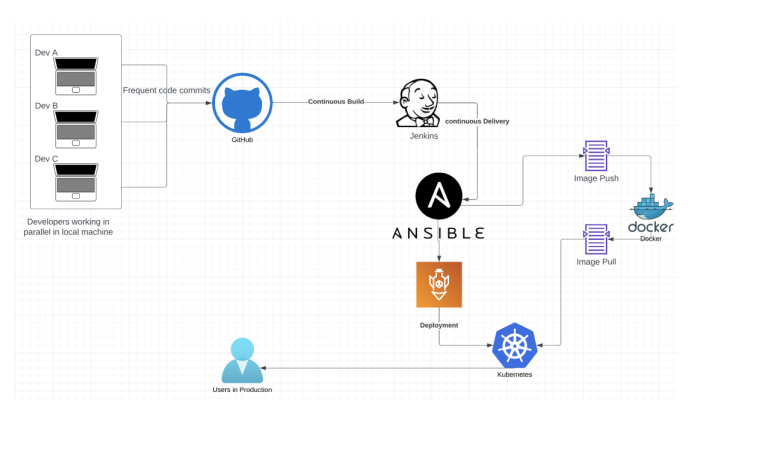
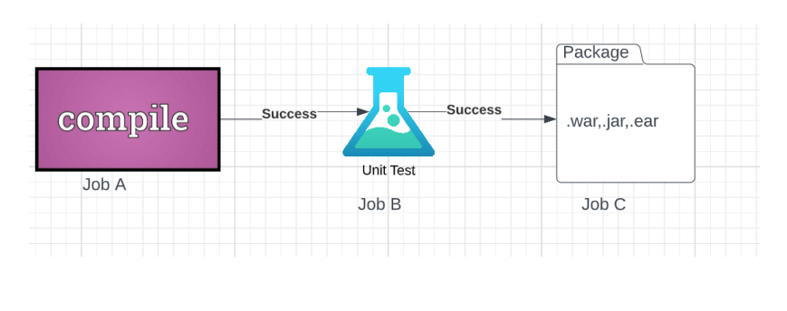
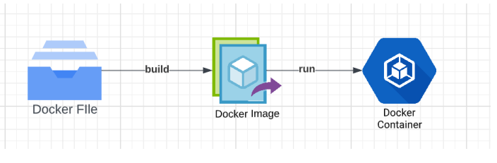

# Building a CI/CD Pipeline for a Retail Company

Industry grade project I.

### 1. Business Challenge/Requirement...
ABC technologies is a leading online retail store. ABC has recently acquired a large retails offline business store.
The business store has large number of stores across the globe but is following
conventional pattern of development and deployment.
As a result, it has landed to great loss and are facing below challenges.
  - low available
  - low scalable
  - low Performance
  - Hard built and maintained
  - Developed and deployed is time consuming

ABC will acquire the data from all these storage systems and plan to use it for analytics and prediction of the firm’s growth and sales prospect. In the first phase ABC has to create the servlets to Add a product and Display product details. Add servlet dependencies required to compile the servlets.
Create an HTML page which will be used to add a product. Team is using git to keep all the source code.

ABC has decided to use DevOps model and Once source code is available in Github, we need to
integrate it with Jenkins and provide continuous build generation for continuous Delivery, integrate
with Ansible and Kubernetes for deployment. Use docker hub to pull and push images between ansible
and Kubernetes. 

### 2. The Goal of the Project
Below are some of the high-level goals of this project:
Implement CICD such that ABC Company to is able to be
1. Highly available
2. Highly scalable
3. Highly Performant
4. Easily built and maintained
5. Developed and deployed quickly

### 3. Data Flow Architecture/Process Flow

Continuous integration pipeline:

Docker:

### 4. Data Explanation and Schema:
Sample Java project has been shared for usage. It is a maven project and has src and test folders created
into it. It has a POM.xml file which lists all needed dependencies to execute this project.

### 5. Problem Statements/Tasks
We need to develop a CICD pipeline to automate the software development, testing, package, deploy
reducing the time to market of app and ensuring good quality service is experienced by end users. In this
project we need to
1. Push the code to out github repository
2. Create a continuous integration pipeline using Jenkins to compile, test and package the code
present in git hub
3. Write docker file to push the war file to tomcat server
4. Integrate docker with Ansible and write playbook
5. Deploy artifacts to Kubernetes cluster
6. Monitor resources using Prometheus

### 6. Pre-requisites:
Verify following software is installed in the working machine
1. Java
2. Maven
3. Git
4. Jenkins
5. Docker
6. Ansible
7. Kubernetes
9. Prometheus

### 7. Approach to Solve:

Task 1: Clone the project from git hub link shared in resources to your local machine. Build the code
using maven commands.

Task 2: Setup git repository and push the source code. Login to Jenkins
1. create 3 jobs
• One for compiling source code
• Second for testing source code
• Third for packing the code
2. Setup CICD pipeline to execute the jobs created in step1
3. Setup master-slave node to distribute the tasks in pipeline

Task 3: Write a Docket file Create an Image and container on docker host. Integrate docker host with
Jenkins. Create CI/CD job on Jenkins to build and deploy on a container
1. Enhance the package job created in step 1 of task 2 to create a docker image
2. In the docker image add code to move the war file to tomcat server and build the
image

Task 4: Integrate Docker host with Ansible. Write ansible playbook to create Image and create
continuer. Integrate Ansible with Jenkins. Deploy ansible playbook. CI/CD job to build code on
ansible and deploy it on docker container
a. Deploy Artifacts on Kubernetes
a. Write pod, service, and deployment manifest file
b. Integrate Kubernetes with ansible
c. Ansible playbook to create deployment and service

Task 5: Using Prometheus monitor the resources like CPU utilization: Total Usage, Usage per core,
usage breakdown, Memory, Network on the instance by providing the end points in local host.
Install node exporter and add URL to target in Prometheus

### 8. Considerations/Assumptions
Resources Needed:
• An AWS account
• A github account
• MobaXterm / Putty
• Git Bash setup
• Source Code

### 9. Deliverables
• Create a detailed solution document with screenshot for each task.
• Please submit the complete code developed by you.
• Please submit all the snapshots.

### 10. Business Benefits
After the solution is built, the business will have the below operational benefits:
• Automate the process of delivery
• Able to achieve dynamic iterations
• Constant integration and delivery
• Technical scalability
• Early error detection
• Transparency in process and org structure
• Reduced production bugs
• Improved customer experience
• Better collaboration between teams
• Improved time to market
