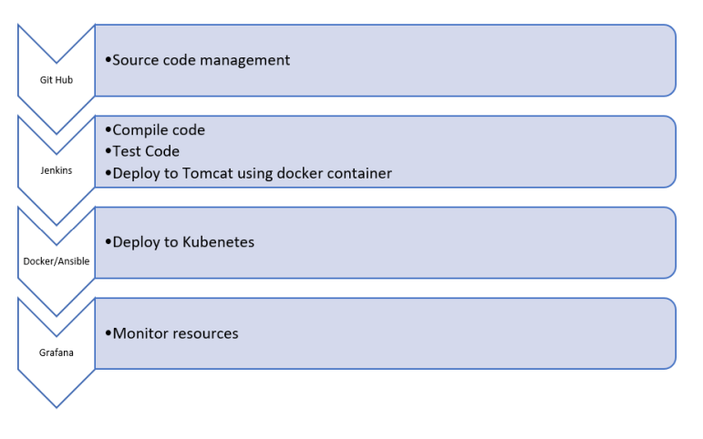

# Building a CI/CD Pipeline for a Tech Company

Industry grade project II.

### 1. Business Challenge/Requirement...
XYZ technologies is a leading online repository for downloading online courses. XYZ plans to have its
repository managed such that it can have admin login and User Login modules. In the first phase team
has created the user login module and has moved it to production. There is a team of developers who
are working on source code creation and add it to source code management tool - git repository.
When the entire source code of application is coded team has used Maven to build the source code.
Once a successful build is created, it is deployed to test server for QE resources to start testing and log
issues which they have found. If any bugs are detected, developers are notified with the help of a
feedback loop. If no bug is encountered, then the code is deployed to pre-prod and eventually to
production server for release. Upon analysis of this process, Management has identified the following
flaws:

1. Entire source code of application is build and then deployed to test server for testing.
2. It takes lot of time for developer to get the test results
3. Accumulation of bugs
4. Consumes a lot of time to debug as entire source code needs to be checked
5. Underutilization of resources as developers are idle until QE give bugs and QE is idle until
entire source code is developed
6. Software to market time is more
7. Feedback mechanism was not robust

In the second phase, XYZ must create the modules such that the admin can view/add/delete Users.
Further company wants to expand their repository to add more courses, add content based on most
seen topic courses. Eventually, down the line company plans to provide course recommendations
based on various user factors to provide good learning experience to the users. In order to achieve the
company goals, Management has decided to leverage DevOps model and overcome above mentioned
challenges.

### 2. The Goal of the Project
Below are some of the high-level goals of this project:
• Develop a continuous integration pipeline in Jenkins to compile, test and package the code
• CICD pipeline to resolve business challenges by XYZ technologies.
• Real-time understanding and hands-on with Git, Jenkins, Ansible, Docker, Kubernetes, and
AWS Devops services

### 3. Data Flow Architecture/Process Flow

### 4. Data Explanation and Schema:
Sample Java project has been shared for usage. It is a maven project and has src and test folders created into it.
It has a POM.xml file which lists all needed dependencies to execute this project.

### 5. Problem Statements/Tasks
We need to develop a CICD pipeline to automate the software development, testing, package, deploy
reducing the time to market of app and ensuring good quality service is experienced by end users. In this
project we need to
1. Push the code to out github repository
2. Create a continuous integration pipeline using Jenkins to compile,test and package the code present
in git hub
3. Write docker file to push the war file to tomcat server
4. Integrate docker with Ansible and write playbook
5. Deploy artifacts to Kubernetes cluster
6. Monitor resources using grafana

### 6. Pre-requisites:
Verify following software is installed in the working machine
1. Java
2. Maven
3. Git
4. Jenkins
5. Docker
6. Ansible
7. Kubernetes
8. Grafana
9. Prometheus

### 7. Approach to Solve:

Task 1: Clone the project from git hub link shared in resources to your local machine. Build the code using
maven commands.

Task 2: Setup git repository and push the source code. Login to Jenkins
1. create a build pipeline containing a job each
• One for compiling source code
• Second for testing source code
• Third for packing the code
2. Execute CICD pipeline to execute the jobs created in step1
3. Setup master-slave node to distribute the tasks in pipeline

Task 3: Write a Docket file Create an Image and container on docker host. Integrate docker host with
Jenkins. Create CI/CD job on Jenkins to build and deploy on a container
1. Enhance the packagejob created in step 1 of task 2 to create a docker image
2. In the docker image add code to move the war file to tomcat server and build the image

Task 4: Integrate Docker host with Ansible. Write ansible playbook to create Image and create continuer.
Integrate Ansible with Jenkins. Deploy ansible-playbook. CI/CD job to build code on ansible and deploy
it on docker container
1. Deploy Artifacts on Kubernetes
2. Write pod, service, and deployment manifest file
3. Integrate Kubernetes with ansible
4. Ansible playbook to create deployment and service

Task 5: Using Prometheus monitor the resources like CPU utilization: Total Usage, Usage per core, usage
breakdown, Memory , Network on the instance by providing the end points in local host. Install node
exporter and add URL to target in Prometheus. Using this data login to Grafana and create a
dashboard to show the metrics.

### 8. Considerations/Assumptions
Resources Needed:
• An AWS account
• A github account
• MobaXterm / Putty
• Git Bash setup
• Source Code

### 9. Deliverables
• Create a detailed solution document with screenshot for each task.
• Please submit complete code developed by you including docker file, playbook etc.
• Please submit all the snapshot

### 10. Business Benefits
Afterthe solution is built, the business will have the below operational benefits:
1. Highly available
2. Highly scalable
3. Highly Performant
4. Easily built and maintained
5. Developed and deployed quickly
6. Lower production bugs
7. Frequent releases
8. Better customer experiences
9. Lesser time to market
11. How to submit the project
You can even upload all the scripts/files/code into your GitHub repository and share your repository
with us.
Also, share the detailed solution document containing a stepwise screenshot of tasks.
