# Building a CI/CD Pipeline for a Retail Company

Instead of a remote server/aws account setup I opted to use a local k3d environment, because I can present every task properly this way too, and it won't require too much change to port it to an other cluster.

## Local DevOps k3d Environment for ABC Technologies

This part  describes local DevOps environment set up for the ABC Technologies CI/CD pipeline project, as specified in `README_ABC.md`. The environment is fully automated using a Makefile and leverages k3d (Kubernetes in Docker), Helm, and a suite of open-source DevOps tools. This environment is designed to be reproducible, versioned, and easy to use for all project tasks.

---

### 1. Overview of the Environment

- **Kubernetes Cluster:** Runs locally using [k3d](https://k3d.io/), which creates a lightweight Kubernetes cluster inside Docker containers.
- **Local Docker Registry:** A private registry is created for caching and sharing container images between builds and deployments.
- **Ingress Controller:** [Traefik](https://traefik.io/) is used as the ingress controller, exposing services securely via HTTPS.
- **DevOps Tools:** Jenkins (CI/CD), Prometheus (monitoring), and Grafana (visualization) are installed via Helm charts.
- **TLS:** [cert-manager](https://cert-manager.io/) issues self-signed certificates for all services, enabling secure HTTPS endpoints.
- **DNS:** [nip.io](https://nip.io/) wildcard DNS is used, so no /etc/hosts changes are needed. All services are accessible via `*.127.0.0.1.nip.io`.

---

### 2. Makefile Structure and Targets

The Makefile automates the entire environment setup. It is organized into sections for binary installation, cluster creation, and deployments. Key features:

- **Binaries are installed locally** in the `./bin` directory (gitignored), ensuring no system pollution.
- **All versions are controlled via variables** at the top of the Makefile for easy upgrades and reproducibility.
- **Idempotent targets:** Each make target checks if the resource already exists before creating it, so repeated runs are safe.

### Key Targets

- `install-binaries`: Installs k3d, kubectl, helm, and ansible in `./bin`. This makes the whole installation environment agnostic, only git and make is needed. I fixed up the versions too, so everything is replicable.
- `create-registry`: Creates a local Docker registry for k3d to cache and share images.
- `create-cluster`: Creates the k3d Kubernetes cluster, with persistent storage for containerd and unique machine IDs for each node.
- `deploy-cert-manager`: Installs cert-manager via Helm (with CRDs), only if not already present.
- `deploy-cluster-issuer`: Applies a self-signed ClusterIssuer for cert-manager.
- `deploy-jenkins`, `deploy-prometheus`, `deploy-grafana`: Installs each tool via Helm, using custom values files and only if not already present.
- `deploy-all`: Runs all the above in order, providing a one-command setup.
- `clean`: Deletes the cluster and registry, cleaning up all resources.

---

### 3. k3d Cluster Details

- **Cluster Name:** `devops-cluster`
- **Nodes:** 1 server, 2 agents (customizable via variables)
- **Registry:** `devops-registry` on port 6551
- **Ingress:** Traefik is exposed on port 443 (HTTPS) on localhost
- **Persistent Storage:** Each node has a dedicated containerd data directory, and unique `/etc/machine-id` for stability, restarting or stopping the cluster will make
- **Image Caching:**
  - The local registry allows you to build and push images once, then pull them from the registry for fast, repeatable deployments.
  - k3d is configured to use this registry for all image pulls and pushes.

---

### 4. Service Addresses

All services are exposed via Traefik ingress with TLS, using nip.io DNS:

- **Jenkins:**      https://jenkins.127.0.0.1.nip.io
- **Prometheus:**   https://prometheus.127.0.0.1.nip.io
- **Grafana:**      https://grafana.127.0.0.1.nip.io

> The browser will warn about a self-signed certificate. This is expected for local development.

---

### 5. Helm Charts and Version Management

- **Helm is installed locally** in `./bin` and used for all deployments.
- **Chart versions are pinned** via variables at the top of the Makefile:
  - `CERT_MANAGER_CHART_VERSION`, `JENKINS_CHART_VERSION`, `PROMETHEUS_CHART_VERSION`, `GRAFANA_CHART_VERSION`
- **Custom values files** are provided in the `values/` directory for each chart, configuring ingress, TLS, and storage.
- **Narrowed pvc sizes** every pvc in the charts is reduced to just 1Gi.
- **Upgrades and rollbacks** are easy: just change the version variable and re-run the deploy target.

---

### 6. How to Use This Environment

1. **Clone the repository**
2. **Run:**
   ```sh
   make deploy-all
   ```
   This will:
   - Install all required binaries
   - Create the registry and cluster
   - Install cert-manager and the self-signed issuer
   - Deploy Jenkins, Prometheus, and Grafana with secure ingress

3. **Wait for the services to come up.**
    ```sh
    ./bin/kubectl get pods -A
    ```
    Expected output:
    ```sh
    NAMESPACE      NAME                                                 READY   STATUS      RESTARTS      AGE
    cert-manager   cert-manager-5969544f77-wmgd5                        1/1     Running     4 (13m ago)   20h
    cert-manager   cert-manager-cainjector-65967ff5cc-wp82x             1/1     Running     0             20h
    cert-manager   cert-manager-webhook-7c665868cb-5h7l9                1/1     Running     0             20h
    jenkins        jenkins-0                                            2/2     Running     0             99s
    kube-system    coredns-ccb96694c-jhcnh                              1/1     Running     0             20h
    kube-system    helm-install-traefik-crd-7484q                       0/1     Completed   0             20h
    kube-system    helm-install-traefik-rnk94                           0/1     Completed   0             19h
    kube-system    local-path-provisioner-5cf85fd84d-bhbwn              1/1     Running     0             20h
    kube-system    metrics-server-5985cbc9d7-7q9mx                      1/1     Running     0             20h
    kube-system    svclb-traefik-50c07505-46msp                         2/2     Running     0             19h
    kube-system    svclb-traefik-50c07505-jt57f                         2/2     Running     0             19h
    kube-system    svclb-traefik-50c07505-knjd6                         2/2     Running     0             19h
    kube-system    traefik-5d45fc8cc9-fbw78                             1/1     Running     0             19h
    monitoring     grafana-bdcf4f54d-mbm7j                              1/1     Running     0             20h
    monitoring     prometheus-alertmanager-0                            1/1     Running     0             13m
    monitoring     prometheus-kube-state-metrics-7fb455bd77-t54f5       1/1     Running     0             20h
    monitoring     prometheus-prometheus-node-exporter-cs22z            1/1     Running     0             20h
    monitoring     prometheus-prometheus-node-exporter-rhmxn            1/1     Running     0             20h
    monitoring     prometheus-prometheus-node-exporter-vm89g            1/1     Running     0             20h
    monitoring     prometheus-prometheus-pushgateway-85f98dc7b7-pktbc   1/1     Running     0             20h
    monitoring     prometheus-server-7588b78f9-wlmj4                    2/2     Running     0             19h
    ```

    The ingresses available:
    ```sh
    ./bin/skubectl get ingresses -A
    ```
    Expected Output:
    ```sh
    NAMESPACE    NAME                CLASS     HOSTS                         ADDRESS                            PORTS     AGE
    jenkins      jenkins             traefik   jenkins.127.0.0.1.nip.io      100.64.4.3,100.64.4.4,100.64.4.5   80, 443   4m5s
    monitoring   grafana             traefik   grafana.127.0.0.1.nip.io      100.64.4.3,100.64.4.4,100.64.4.5   80, 443   20h
    monitoring   prometheus-server   traefik   prometheus.127.0.0.1.nip.io   100.64.4.3,100.64.4.4,100.64.4.5   80, 443   20h
    ```
4. **Access the services** at the URLs above.

5. **To clean up:**
   ```sh
   make clean
   ```

---

### 7. Customization and Extensibility

- **Change chart versions** by editing the variables at the top of the Makefile.
- **Edit ingress hostnames or TLS settings** in the `values/` files.
- **Add more tools** by creating new deploy targets and values files.
- **Integrate with CI/CD** by scripting builds and deployments using the Makefile.

---

### 8. Why This Environment?

- **Reproducible:** All dependencies and versions are controlled.
- **Isolated:** No system-level changes; everything is local to the project.
- **Fast:** Local registry and persistent storage speed up builds and deployments.
- **Secure:** All endpoints use HTTPS, even for local development.
- **Flexible:** Easy to extend for new tools or workflows.

---

### 9. References
- [k3d documentation](https://k3d.io/)
- [Helm documentation](https://helm.sh/)
- [cert-manager documentation](https://cert-manager.io/)
- [Traefik documentation](https://doc.traefik.io/traefik/)
- [nip.io](https://nip.io/)

---

This environment is now ready to be used for all ABC Technologies DevOps tasks, including CI/CD, containerization, deployment, and monitoring, as described in the project requirements.

## Creating the pipeline

The repository is cloned out, let's do the tasks one by one.

## Task 1:
Clone the project from git hub link shared in resources to your local machine. Build the code
using maven commands.

### ABCTechnologies Maven Makefile Integration

A dedicated `Makefile.ABCTech` is placed in the root of the repository. This file provides convenient targets for compiling, testing, packaging, cleaning, and installing the Maven project in the `ABCTechnologies` directory, all using Dockerized Maven. This approach ensures a consistent build environment without requiring Maven or Java to be installed on the host system.

To use these targets, run the following commands from the project root, specifying the Makefile with `-f`:

```
make -f Makefile.ABCTech compile      # Compiles the ABCTechnologies Maven project
make -f Makefile.ABCTech test         # Runs tests
make -f Makefile.ABCTech package      # Packages the project
make -f Makefile.ABCTech clean        # Cleans the build
make -f Makefile.ABCTech install      # Cleans and installs the project
```

All commands are executed in a Maven Docker container, mounting the `ABCTechnologies` directory for isolation and reproducibility.

This setup is ideal for CI/CD and local development, ensuring builds are always performed in a clean, controlled environment.

#### Example output for each command:

Let's compile:
```sh
make -f Makefile.ABCTech compile
```
Output:
```sh
docker run --rm -v /home/uih20178/Github/purdue-final-devops-project/ABCTechnologies:/app -w /app maven:3.9.6-eclipse-temurin-17 mvn compile
Unable to find image 'maven:3.9.6-eclipse-temurin-17' locally
3.9.6-eclipse-temurin-17: Pulling from library/maven
4a023cab5400: Pull complete
5e5d1bccc544: Pull complete
d59fd278c1b4: Pull complete
c97285723537: Pull complete
a3ba11f7aaae: Pull complete
67f99c2668af: Pull complete
45f480637770: Pull complete
58c3491a14eb: Pull complete
4712dfa85971: Pull complete
fc06d68d71ba: Pull complete
Digest: sha256:29a1658b1f3078e07c2b17f7b519b45eb47f65d9628e887eac45a8c5c8f939d4
Status: Downloaded newer image for maven:3.9.6-eclipse-temurin-17
[INFO] Scanning for projects...
[INFO]
[INFO] ----------------------< com.abc:ABCtechnologies >-----------------------
[INFO] Building RetailModule 1.0
[INFO]   from pom.xml
[INFO] --------------------------------[ war ]---------------------------------
Downloading from central: https://repo.maven.apache.org/maven2/org/jacoco/jacoco-maven-plugin/0.8.6/jacoco-maven-plugin-0.8.6.pom
Downloaded from central: https://repo.maven.apache.org/maven2/org/jacoco/jacoco-maven-plugin/0.8.6/jacoco-maven-plugin-0.8.6.pom (4.4 kB at 16 kB/s)
Downloading from central: https://repo.maven.apache.org/maven2/org/jacoco/org.jacoco.build/0.8.6/org.jacoco.build-0.8.6.pom
Downloaded from central: https://repo.maven.apache.org/maven2/org/jacoco/org.jacoco.build/0.8.6/org.jacoco.build-0.8.6.pom (42 kB at 1.1 MB/s)
Downloading from central: https://repo.maven.apache.org/maven2/org/jacoco/jacoco-maven-plugin/0.8.6/jacoco-maven-plugin-0.8.6.jar
Downloaded from central: https://repo.maven.apache.org/maven2/org/jacoco/jacoco-maven-plugin/0.8.6/jacoco-maven-plugin-0.8.6.jar (53 kB at 1.9 MB/s)
Downloading from central: https://repo.maven.apache.org/maven2/org/apache/maven/plugins/maven-resources-plugin/3.3.1/maven-resources-plugin-3.3.1.pom
Downloaded from central: https://repo.maven.apache.org/maven2/org/apache/maven/plugins/maven-resources-plugin/3.3.1/maven-resources-plugin-3.3.1.pom (8.2 kB at 544 kB/s)
...
Downloaded from central: https://repo.maven.apache.org/maven2/org/codehaus/plexus/plexus-compiler-manager/2.13.0/plexus-compiler-manager-2.13.0.jar (4.7 kB at 36 kB/s)
Downloaded from central: https://repo.maven.apache.org/maven2/org/codehaus/plexus/plexus-compiler-javac/2.13.0/plexus-compiler-javac-2.13.0.jar (23 kB at 163 kB/s)
Downloaded from central: https://repo.maven.apache.org/maven2/org/codehaus/plexus/plexus-utils/3.5.0/plexus-utils-3.5.0.jar (267 kB at 1.6 MB/s)
[INFO] Changes detected - recompiling the module! :source
[INFO] Compiling 3 source files with javac [debug target 1.8] to target/classes
[WARNING] bootstrap class path not set in conjunction with -source 8
[INFO] ------------------------------------------------------------------------
[INFO] BUILD SUCCESS
[INFO] ------------------------------------------------------------------------
[INFO] Total time:  3.933 s
[INFO] Finished at: 2025-07-31T09:59:55Z
[INFO] ------------------------------------------------------------------------
```

Then test:
```sh
make -f Makefile.ABCTech test
```
Example output:
```sh
docker run --rm -v /home/uih20178/Github/purdue-final-devops-project/ABCTechnologies:/app -w /app maven:3.9.6-eclipse-temurin-17 mvn test
[INFO] Scanning for projects...
[INFO]
[INFO] ----------------------< com.abc:ABCtechnologies >-----------------------
[INFO] Building RetailModule 1.0
[INFO]   from pom.xml
[INFO] --------------------------------[ war ]---------------------------------
Downloading from central: https://repo.maven.apache.org/maven2/org/jacoco/jacoco-maven-plugin/0.8.6/jacoco-maven-plugin-0.8.6.pom
Downloaded from central: https://repo.maven.apache.org/maven2/org/jacoco/jacoco-maven-plugin/0.8.6/jacoco-maven-plugin-0.8.6.pom (4.4 kB at 17 kB/s)
Downloading from central: https://repo.maven.apache.org/maven2/org/jacoco/org.jacoco.build/0.8.6/org.jacoco.build-0.8.6.pom
Downloaded from central: https://repo.maven.apache.org/maven2/org/jacoco/org.jacoco.build/0.8.6/org.jacoco.build-0.8.6.pom (42 kB at 1.1 MB/s)
...
Downloaded from central: https://repo.maven.apache.org/maven2/org/apache/maven/surefire/common-junit3/3.2.2/common-junit3-3.2.2.jar (12 kB at 918 kB/s)
Downloaded from central: https://repo.maven.apache.org/maven2/org/apache/maven/surefire/common-junit4/3.2.2/common-junit4-3.2.2.jar (26 kB at 2.0 MB/s)
Downloaded from central: https://repo.maven.apache.org/maven2/org/apache/maven/surefire/common-java5/3.2.2/common-java5-3.2.2.jar (18 kB at 878 kB/s)
[INFO]
[INFO] -------------------------------------------------------
[INFO]  T E S T S
[INFO] -------------------------------------------------------
[INFO] Running com.abc.dataAccessObject.ProductImpTest
[INFO] Tests run: 4, Failures: 0, Errors: 0, Skipped: 0, Time elapsed: 0.041 s -- in com.abc.dataAccessObject.ProductImpTest
[INFO]
[INFO] Results:
[INFO]
[INFO] Tests run: 4, Failures: 0, Errors: 0, Skipped: 0
[INFO]
[INFO] ------------------------------------------------------------------------
[INFO] BUILD SUCCESS
[INFO] ------------------------------------------------------------------------
[INFO] Total time:  9.176 s
[INFO] Finished at: 2025-07-31T10:01:07Z
[INFO] ------------------------------------------------------------------------
```

Then package:
```sh
make -f Makefile.ABCTech package
```
Example output:
```sh
docker run --rm -v /home/uih20178/Github/purdue-final-devops-project/ABCTechnologies:/app -w /app maven:3.9.6-eclipse-temurin-17 mvn package
[INFO] Scanning for projects...
[INFO]
[INFO] ----------------------< com.abc:ABCtechnologies >-----------------------
[INFO] Building RetailModule 1.0
[INFO]   from pom.xml
[INFO] --------------------------------[ war ]---------------------------------
Downloading from central: https://repo.maven.apache.org/maven2/org/jacoco/jacoco-maven-plugin/0.8.6/jacoco-maven-plugin-0.8.6.pom
Downloaded from central: https://repo.maven.apache.org/maven2/org/jacoco/jacoco-maven-plugin/0.8.6/jacoco-maven-plugin-0.8.6.pom (4.4 kB at 16 kB/s)
Downloading from central: https://repo.maven.apache.org/maven2/org/jacoco/org.jacoco.build/0.8.6/org.jacoco.build-0.8.6.pom
Downloaded from central: https://repo.maven.apache.org/maven2/org/jacoco/org.jacoco.build/0.8.6/org.jacoco.build-0.8.6.pom (42 kB at 1.0 MB/s)
Downloading from central: https://repo.maven.apache.org/maven2/org/jacoco/jacoco-maven-plugin/0.8.6/jacoco-maven-plugin-0.8.6.jar
Downloaded from central: https://repo.maven.apache.org/maven2/org/jacoco/jacoco-maven-plugin/0.8.6/jacoco-maven-plugin-0.8.6.jar (53 kB at 1.1 MB/s)
...
Downloaded from central: https://repo.maven.apache.org/maven2/org/apache/maven/shared/maven-mapping/3.0.0/maven-mapping-3.0.0.jar (11 kB at 82 kB/s)
Downloaded from central: https://repo.maven.apache.org/maven2/com/thoughtworks/xstream/xstream/1.4.10/xstream-1.4.10.jar (590 kB at 3.8 MB/s)
[INFO] Packaging webapp
[INFO] Assembling webapp [ABCtechnologies] in [/app/target/ABCtechnologies-1.0]
[INFO] Processing war project
[INFO] Copying webapp resources [/app/src/main/webapp]
[INFO] Webapp assembled in [42 msecs]
[INFO] Building war: /app/target/ABCtechnologies-1.0.war
[INFO]
[INFO] --- jacoco:0.8.6:report (jacoco-site) @ ABCtechnologies ---
[INFO] Loading execution data file /app/target/jacoco.exec
[INFO] Analyzed bundle 'RetailModule' with 2 classes
[INFO] ------------------------------------------------------------------------
[INFO] BUILD SUCCESS
[INFO] ------------------------------------------------------------------------
[INFO] Total time:  7.866 s
[INFO] Finished at: 2025-07-31T11:42:41Z
[INFO] ------------------------------------------------------------------------
```

Then try out the clean:

```sh
make -f Makefile.ABCTech clean
```
Example output:
```sh
docker run --rm -v /home/uih20178/Github/purdue-final-devops-project/ABCTechnologies:/app -w /app maven:3.9.6-eclipse-temurin-17 mvn clean
[INFO] Scanning for projects...
[INFO]
[INFO] ----------------------< com.abc:ABCtechnologies >-----------------------
[INFO] Building RetailModule 1.0
[INFO]   from pom.xml
[INFO] --------------------------------[ war ]---------------------------------
Downloading from central: https://repo.maven.apache.org/maven2/org/jacoco/jacoco-maven-plugin/0.8.6/jacoco-maven-plugin-0.8.6.pom
Downloaded from central: https://repo.maven.apache.org/maven2/org/jacoco/jacoco-maven-plugin/0.8.6/jacoco-maven-plugin-0.8.6.pom (4.4 kB at 20 kB/s)
Downloading from central: https://repo.maven.apache.org/maven2/org/jacoco/org.jacoco.build/0.8.6/org.jacoco.build-0.8.6.pom
...
Downloading from central: https://repo.maven.apache.org/maven2/commons-io/commons-io/2.6/commons-io-2.6.jar
Downloaded from central: https://repo.maven.apache.org/maven2/commons-io/commons-io/2.6/commons-io-2.6.jar (215 kB at 7.4 MB/s)
[INFO] Deleting /app/target
[INFO] ------------------------------------------------------------------------
[INFO] BUILD SUCCESS
[INFO] ------------------------------------------------------------------------
[INFO] Total time:  0.928 s
[INFO] Finished at: 2025-07-31T11:37:23Z
[INFO] ------------------------------------------------------------------------
```

We can run a clean install too:
```sh
make -f Makefile.ABCTech clean install
```
Example output:
```sh
docker run --rm -v /home/uih20178/Github/purdue-final-devops-project/ABCTechnologies:/app -w /app maven:3.9.6-eclipse-temurin-17 mvn clean
[INFO] Scanning for projects...
[INFO]
[INFO] ----------------------< com.abc:ABCtechnologies >-----------------------
[INFO] Building RetailModule 1.0
[INFO]   from pom.xml
[INFO] --------------------------------[ war ]---------------------------------
Downloading from central: https://repo.maven.apache.org/maven2/org/jacoco/jacoco-maven-plugin/0.8.6/jacoco-maven-plugin-0.8.6.pom
Downloaded from central: https://repo.maven.apache.org/maven2/org/jacoco/jacoco-maven-plugin/0.8.6/jacoco-maven-plugin-0.8.6.pom (4.4 kB at 14 kB/s)
...
Downloaded from central: https://repo.maven.apache.org/maven2/org/codehaus/plexus/plexus-utils/3.1.0/plexus-utils-3.1.0.jar (262 kB at 1.7 MB/s)
[INFO] Packaging webapp
[INFO] Assembling webapp [ABCtechnologies] in [/app/target/ABCtechnologies-1.0]
[INFO] Processing war project
[INFO] Copying webapp resources [/app/src/main/webapp]
[INFO] Webapp assembled in [48 msecs]
[INFO] Building war: /app/target/ABCtechnologies-1.0.war
[INFO]
[INFO] --- jacoco:0.8.6:report (jacoco-site) @ ABCtechnologies ---
[INFO] Loading execution data file /app/target/jacoco.exec
[INFO] Analyzed bundle 'RetailModule' with 2 classes
[INFO]
[INFO] --- install:3.1.1:install (default-install) @ ABCtechnologies ---
[INFO] Installing /app/pom.xml to /root/.m2/repository/com/abc/ABCtechnologies/1.0/ABCtechnologies-1.0.pom
[INFO] Installing /app/target/ABCtechnologies-1.0.war to /root/.m2/repository/com/abc/ABCtechnologies/1.0/ABCtechnologies-1.0.war
[INFO] ------------------------------------------------------------------------
[INFO] BUILD SUCCESS
[INFO] ------------------------------------------------------------------------
[INFO] Total time:  7.499 s
[INFO] Finished at: 2025-07-31T11:38:34Z
[INFO] ------------------------------------------------------------------------
```

## Task 2
Setup git repository and push the source code. Login to Jenkins
1. create 3 jobs
  - One for compiling source code
  - Second for testing source code
  - Third for packing the code
2. Setup CICD pipeline to execute the jobs created in step1
3. Setup master-slave node to distribute the tasks in pipeline

### Repository

The repository is available at:
https://github.com/hajnalmt/purdue-final-devops-project

### Login to jenkins
Admin credentials are available in the base secret:

User:
```sh
 ./bin/kubectl get secrets -n jenkins jenkins -o json  | jq -r '.data."jenkins-admin-user"' |
base64 -d
```
Example output:
```sh
admin
```

Password
```sh
./bin/kubectl get secrets -n jenkins jenkins -o json  | jq -r '.data."jenkins-admin-password"' | base64 -d
```
Example output:
```sh
iy3pZITxcIRXUUcpMQ1km3
```


### About the plugins:
The kubernetes and docker plugins should be available.
Go to Manage Jenkins → Manage Plugins and search for them.

Verifying kubernetes plugin availability :


Docker plugin wasn't installed for me:
I installed them:


### Let's use the kubernetes k3d cluster in place to start our agents!
For earlier release we need to add a Kubernetes Cloud:

Go to “Manage Jenkins” → “System Configuration” → “Clouds”.
Add a new “Kubernetes” cloud.
Set Kubernetes URL to https://kubernetes.default (in-cluster) or your cluster’s API endpoint.
Credentials: Use “Kubernetes Service Account” (default for in-cluster Jenkins).
Test Connection.

For the currently used ones:

This is already there for us!


==The environment is giving us a Master-Slave architecture by default!==

Let's create a Pod template:


> **_NOTE:_** It's important to set the "Name of the container that will run the Jenkins agent to "maven-agent" too. Additionally I needed to tick in the "Inject Jenkins agent in agent container?" boolean.

### We can use the new template created
I have created a Jenkins Folder ABC Technologies and a Freestyle pipeline for each step.
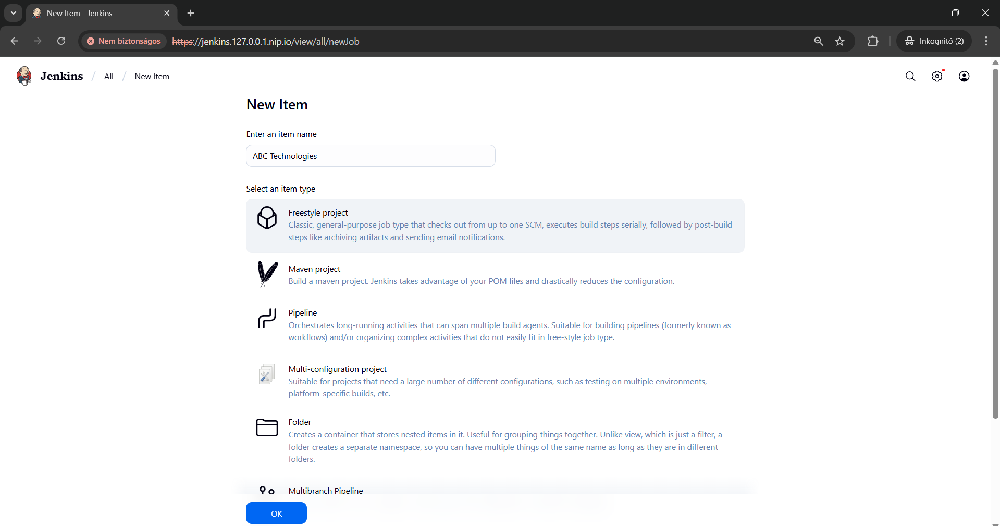
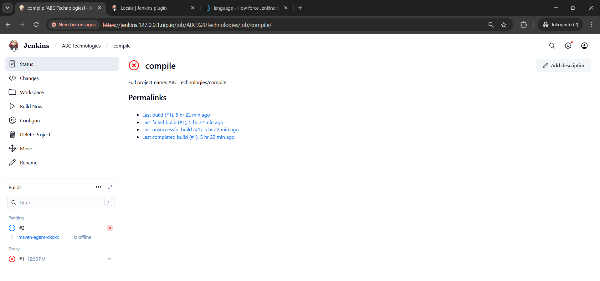

The pipeline will clone the repository:


Also it will execute simple mvn compile command in the appropriate directory.
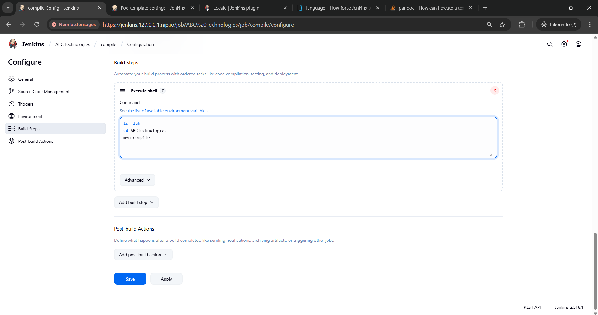

### Creating the pipeline
Building the pipeline created, will result in a Console output like this:
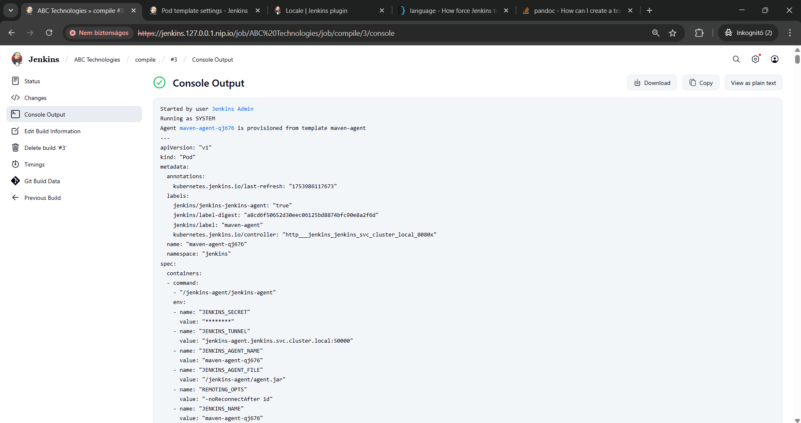
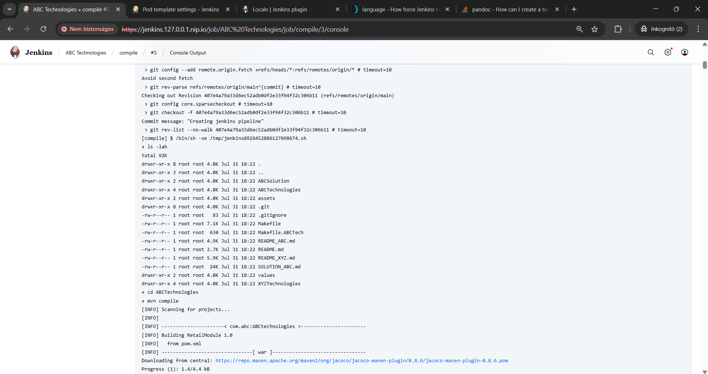
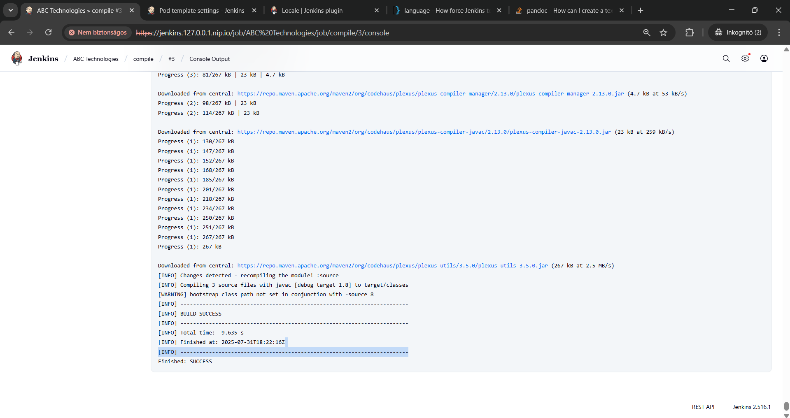

We can create the rest, of the pipelines with the test and package commands.
Don't forget to set the build triggers too do if we build the test project each of the others will be triggered.
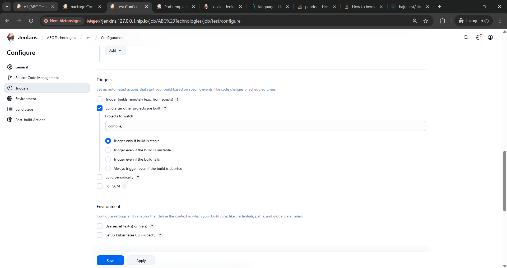
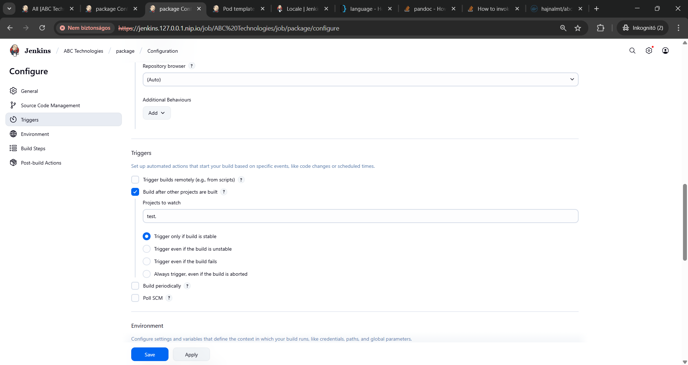

I went with the clean install command and the archived the artifacts in the post build step:
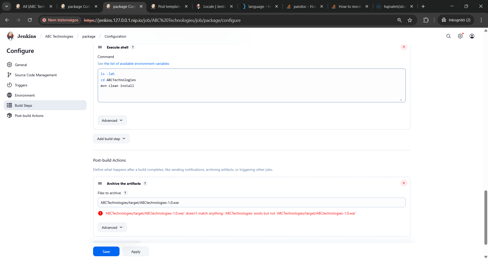

## Task 3
Write a Docket file Create an Image and container on docker host. Integrate docker host with
Jenkins. Create CI/CD job on Jenkins to build and deploy on a container
1. Enhance the package job created in step 1 of task 2 to create a docker image
2. In the docker image add code to move the war file to tomcat server and build the
image

### Created Dockerfiles
There is a Dockerfile under the ABCSolution directory based on the classes.
Alternatively a minified tomcat Dockerfile (tomcat.Dockerfile) and a minified Ubuntu Dockerfile (ubuntu.Dockerfile) can be used.

Dockerfile:

```Dockerfile
FROM docker.io/library/ubuntu:22.04
RUN apt-get -y update && apt-get -y upgrade
RUN apt-get -y install openjdk-17-jdk wget
RUN mkdir /usr/local/tomcat
ADD https://dlcdn.apache.org/tomcat/tomcat-9/v9.0.107/bin/apache-tomcat-9.0.107.tar.gz  /tmp/apache-tomcat-9.0.107.tar.gz
RUN cd /tmp &&  tar xvfz apache-tomcat-9.0.107.tar.gz
RUN cp -Rv /tmp/apache-tomcat-9.0.107/* /usr/local/tomcat/
COPY **/*.war /usr/local/tomcat/webapps/
EXPOSE 8080
CMD /usr/local/tomcat/bin/catalina.sh run
```

tomcat.Dockerfile:
```Dockerfile
FROM tomcat:9.0.107-jdk17-temurin

RUN rm -rf /usr/local/tomcat/webapps/*

COPY **/*.war /usr/local/tomcat/webapps/

EXPOSE 8080

CMD ["catalina.sh", "run"]
```

ubuntu.Dockerfile:
```Dockerfile
FROM ubuntu:22.04

ARG TOMCAT_VERSION=9.0.107

RUN apt-get update && \
    apt-get -y upgrade && \
    apt-get -y install openjdk-17-jdk wget curl && \
    rm -rf /var/lib/apt/lists/*

RUN mkdir -p /usr/local/tomcat && \
    wget -q https://dlcdn.apache.org/tomcat/tomcat-9/v${TOMCAT_VERSION}/bin/apache-tomcat-${TOMCAT_VERSION}.tar.gz -O /tmp/tomcat.tar.gz && \
    tar xzf /tmp/tomcat.tar.gz -C /usr/local/tomcat --strip-components=1 && \
    rm /tmp/tomcat.tar.gz

COPY **/*.war /usr/local/tomcat/webapps/

EXPOSE 8080

HEALTHCHECK --interval=30s --timeout=5s --start-period=30s --retries=3 \
  CMD curl -f http://localhost:8080/ || exit 1

CMD ["/usr/local/tomcat/bin/catalina.sh", "run"]
```

They will result in nearly the same image.

### Jenkins Build step
Build and Publish the docker images
The final step is the docker build and push:
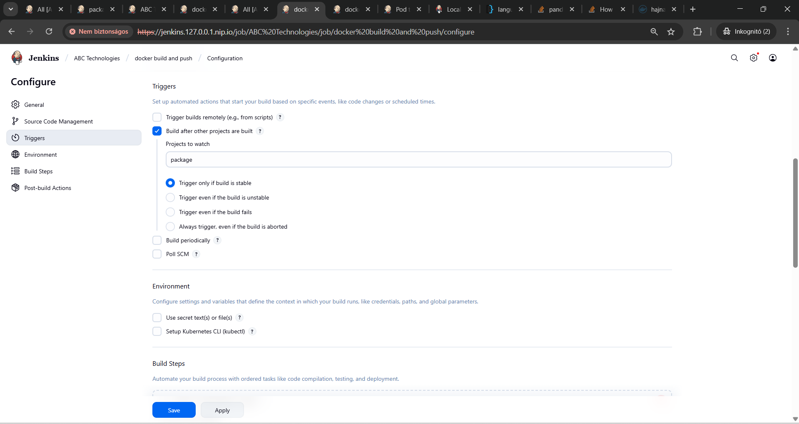
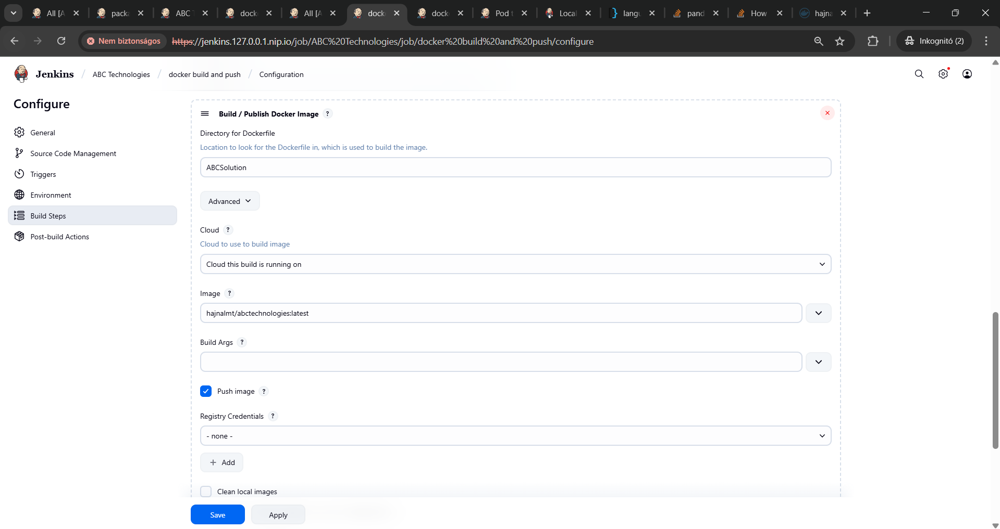

I used my local machine as the server for it and setup my credentials in Jenkins.

If everything is alright the image is pushed and ready:
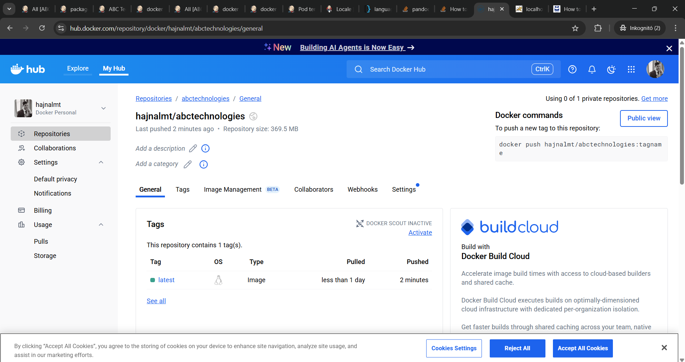

It's under the "hajnalmt/abctechnologies:latest" tag.

## Task 4
Task 4: Integrate Docker host with Ansible. Write ansible playbook to create Image and create
continuer. Integrate Ansible with Jenkins. Deploy ansible playbook. CI/CD job to build code on
ansible and deploy it on docker container
a. Deploy Artifacts on Kubernetes
a. Write pod, service, and deployment manifest file
b. Integrate Kubernetes with ansible
c. Ansible playbook to create deployment and service

### Ansible playbook created
There is an ansible playbook ready to run which builds the image, starts the container and applyies the deployment manifests in the abc namespace.

The playbook is under ABCSolution/ansible.yaml:
```yaml
- hosts: local
  become: false
  vars:
    project_dir: "{{ lookup('env', 'PWD') }}"
    image_name: "hajnalmt/abctechnologies"
    image_tag: "latest"
    dockerfile_path: "{{ project_dir }}/ABCSolution/Dockerfile"
    build_context: "{{ project_dir }}/ABCTechnologies"
    container_name: "abc-application"
    k8s_yaml: "{{ project_dir }}/ABCSolution/deployment.yaml"
  tasks:
    - name: Build Docker image for ABCTechnologies
      community.docker.docker_image:
        build:
          path: "{{ build_context }}"
          dockerfile: "{{ dockerfile_path }}"
        name: "{{ image_name }}"
        tag: "{{ image_tag }}"
        push: false
        source: build
      register: build_result

    - name: Show build result
      debug:
        var: build_result

    - name: Start the container
      community.docker.docker_container:
        name: "{{ container_name }}"
        image: "{{ image_name }}:{{ image_tag }}"
        state: started
        ports:
          - "8080:8080"
        restart_policy: always
      register: container_result

    - name: Show container result
      debug:
        var: container_result

    - name: Apply all Kubernetes YAMLs in ABCSolution
      shell: |
        kubectl apply -f "{{ k8s_yaml }}" --namespace=abc
      args:
        executable: /bin/bash
      register: k8s_apply_result

    - name: Show kubectl apply result
      debug:
        var: k8s_apply_result.stdout_lines
```

The kubernetes service manifests are containing an additional namespace and ingress related settings too. See ABCSolution/deployment.yaml

```yaml
apiVersion: v1
kind: Namespace
metadata:
  name: abc
---
kind: Deployment
apiVersion: apps/v1
metadata:
  namespace: abc
  name: abc-tech-dep
spec:
    replicas: 2
    minReadySeconds: 45
    strategy:
        type: RollingUpdate
        rollingUpdate:
            maxUnavailable: 1
            maxSurge: 2
    selector:
        matchLabels:
            app: abc-tech-app
    template:
        metadata:
            labels:
                app: abc-tech-app
        spec:
            containers:
                - image: hajnalmt/abctechnologies:test
                  name: app
---
kind: Service
apiVersion: v1
metadata:
    name: abc-tech-service
    namespace: abc
spec:
    type: NodePort
    selector:
        app: abc-tech-app
    ports:
        - port: 80 #cluster port
          targetPort: 8080 #container image port
          nodePort: 30080 #node port
---
apiVersion: networking.k8s.io/v1
kind: Ingress
metadata:
  name: abc-tech-ingress
  namespace: abc
  annotations:
    kubernetes.io/ingress.class: traefik
    cert-manager.io/cluster-issuer: selfsigned-issuer
    traefik.ingress.kubernetes.io/router.entrypoints: websecure
spec:
  tls:
    - hosts:
        - abc.abc.127.0.0.1.nip.io
      secretName: abc-tech-tls
  rules:
    - host: abc.abc.127.0.0.1.nip.io
      http:
        paths:
          - path: /
            pathType: Prefix
            backend:
              service:
                name: abc-tech-service
                port:
                  number: 80
```

By executing the ansible playbook:

```bash
./bin/ansible-playbook -i ABCSolution/hosts ABCSolution/ansible.yaml
```
or by invoking the make ansible target

```bash
make ansible
```

The playbook will deploy everything:
```bash
PLAY [local] ***********************************************************************************************************************************************

TASK [Gathering Facts] *************************************************************************************************************************************
ok: [localhost]

TASK [Build Docker image for ABCTechnologies] **************************************************************************************************************
ok: [localhost]

TASK [Show build result] ***********************************************************************************************************************************
ok: [localhost] => {
    "build_result": {
        "actions": [],
        "changed": false,
        "failed": false,
        "image": {
            "Architecture": "amd64",
            "Author": "",
            "Comment": "buildkit.dockerfile.v0",
            "Config": {
                "ArgsEscaped": true,
                "Cmd": [
                    "/bin/sh",
                    "-c",
                    "/usr/local/tomcat/bin/catalina.sh run"
                ],
                "Entrypoint": null,
                "Env": [
                    "PATH=/usr/local/sbin:/usr/local/bin:/usr/sbin:/usr/bin:/sbin:/bin"
                ],
                "ExposedPorts": {
                    "8080/tcp": {}
                },
                "Labels": {
                    "org.opencontainers.image.ref.name": "ubuntu",
                    "org.opencontainers.image.version": "22.04"
                },
                "OnBuild": null,
                "User": "",
                "Volumes": null,
                "WorkingDir": ""
            },
            "Created": "2025-07-31T23:23:46.903394362+02:00",
            "DockerVersion": "",
            "GraphDriver": {
                "Data": {
                    "LowerDir": "/var/lib/docker/overlay2/0zu1lj15xm8bg2fcqd42x04z9/diff:/var/lib/docker/overlay2/jmyeu5gba2kmcxrs23vrgztbm/diff:/var/lib/docker/overlay2/x3w0d7qd4sh1x0x9ns3efq81s/diff:/var/lib/docker/overlay2/kwv7hd4lv7n8fm0155mmw48r5/diff:/var/lib/docker/overlay2/srk9oc6ixnvvk4mdukzwzml6m/diff:/var/lib/docker/overlay2/hcj3b51i0b47k2gu63e3dfgg5/diff:/var/lib/docker/overlay2/f26e38621272e3f2f166676f96029fc4439b6d0a146f08bfb7cb2bb3a9e68e4b/diff",
                    "MergedDir": "/var/lib/docker/overlay2/x4e3y5gx8cciqq2t2xrqfr3sc/merged",
                    "UpperDir": "/var/lib/docker/overlay2/x4e3y5gx8cciqq2t2xrqfr3sc/diff",
                    "WorkDir": "/var/lib/docker/overlay2/x4e3y5gx8cciqq2t2xrqfr3sc/work"
                },
                "Name": "overlay2"
            },
            "Id": "sha256:dcd5054ff8afb2ffe9116e81b70887ad0c77d2a518941c0e17f998490d93a348",
            "Metadata": {
                "LastTagTime": "2025-07-31T23:23:46.951863912+02:00"
            },
            "Os": "linux",
            "Parent": "",
            "RepoDigests": [
                "hajnalmt/abctechnologies@sha256:3e6abbb2844e8578e0cdfa06f644442d82a3c747bf9ed3a8cfbfb877e69dfcb9"
            ],
            "RepoTags": [
                "hajnalmt/abctechnologies:latest"
            ],
            "RootFS": {
                "Layers": [
                    "sha256:f862e1968e4b4c3c3af141e37d2ec22b19ec0fd50d6a8aaf683de6729e296226",
                    "sha256:fbfc77a149b98b397e04665c10b7a0bfcc27bf7c3d5e83e9c6caca5e2b9127f1",
                    "sha256:79aecb57f91b1bc1ab495da8bae0b3fbc782c36049484477c51279e95c893f71",
                    "sha256:aaed7b767d496ed96a879aa8254fea2bd9335dd339025ce5b2ceb612a68b1559",
                    "sha256:98913b3e5abee22ebb0854d357e48ab7207064caf12e29be7d28a24331b7b337",
                    "sha256:0b5e53c6beb1b99686b6fd197527696fc9d77df6589af64afd1b2173b4c4f651",
                    "sha256:c8b3eb7c7f8c15f94b8a688b3e6555d2e77ac3ecd379f3899f180d4959677abf",
                    "sha256:0d8d67cd96f34a46e9832f32af7cc76e364d8dc725e1c4fb0695a7cb164fd359"
                ],
                "Type": "layers"
            },
            "Size": 838468755
        }
    }
}

TASK [Start the container] *********************************************************************************************************************************
changed: [localhost]

TASK [Show container result] *******************************************************************************************************************************
ok: [localhost] => {
    "container_result": {
        "changed": true,
        "container": {
            "AppArmorProfile": "",
            "Args": [
                "-c",
                "/usr/local/tomcat/bin/catalina.sh run"
            ],
            "Config": {
                "AttachStderr": true,
                "AttachStdin": false,
                "AttachStdout": true,
                "Cmd": [
                    "/bin/sh",
                    "-c",
                    "/usr/local/tomcat/bin/catalina.sh run"
                ],
                "Domainname": "",
                "Entrypoint": null,
                "Env": [
                    "PATH=/usr/local/sbin:/usr/local/bin:/usr/sbin:/usr/bin:/sbin:/bin"
                ],
                "ExposedPorts": {
                    "8080/tcp": {}
                },
                "Hostname": "e7249262196d",
                "Image": "hajnalmt/abctechnologies:latest",
                "Labels": {
                    "org.opencontainers.image.ref.name": "ubuntu",
                    "org.opencontainers.image.version": "22.04"
                },
                "OnBuild": null,
                "OpenStdin": false,
                "StdinOnce": false,
                "Tty": false,
                "User": "",
                "Volumes": null,
                "WorkingDir": ""
            },
            "Created": "2025-07-31T22:49:25.010035945Z",
            "Driver": "overlay2",
            "ExecIDs": null,
            "GraphDriver": {
                "Data": {
                    "ID": "e7249262196dde05a4aa077e0fc95d3a6a7d542c07bc7659879b234e4b0fb813",
                    "LowerDir": "/var/lib/docker/overlay2/ef1fbc7d88243c0ed9ee7a328ed1482006c5ec6caba69ef4e71712015d592f00-init/diff:/var/lib/docker/overlay2/x4e3y5gx8cciqq2t2xrqfr3sc/diff:/var/lib/docker/overlay2/0zu1lj15xm8bg2fcqd42x04z9/diff:/var/lib/docker/overlay2/jmyeu5gba2kmcxrs23vrgztbm/diff:/var/lib/docker/overlay2/x3w0d7qd4sh1x0x9ns3efq81s/diff:/var/lib/docker/overlay2/kwv7hd4lv7n8fm0155mmw48r5/diff:/var/lib/docker/overlay2/srk9oc6ixnvvk4mdukzwzml6m/diff:/var/lib/docker/overlay2/hcj3b51i0b47k2gu63e3dfgg5/diff:/var/lib/docker/overlay2/f26e38621272e3f2f166676f96029fc4439b6d0a146f08bfb7cb2bb3a9e68e4b/diff",
                    "MergedDir": "/var/lib/docker/overlay2/ef1fbc7d88243c0ed9ee7a328ed1482006c5ec6caba69ef4e71712015d592f00/merged",
                    "UpperDir": "/var/lib/docker/overlay2/ef1fbc7d88243c0ed9ee7a328ed1482006c5ec6caba69ef4e71712015d592f00/diff",
                    "WorkDir": "/var/lib/docker/overlay2/ef1fbc7d88243c0ed9ee7a328ed1482006c5ec6caba69ef4e71712015d592f00/work"
                },
                "Name": "overlay2"
            },
            "HostConfig": {
                "AutoRemove": false,
                "Binds": null,
                "BlkioDeviceReadBps": null,
                "BlkioDeviceReadIOps": null,
                "BlkioDeviceWriteBps": null,
                "BlkioDeviceWriteIOps": null,
                "BlkioWeight": 0,
                "BlkioWeightDevice": null,
                "CapAdd": null,
                "CapDrop": null,
                "Cgroup": "",
                "CgroupParent": "",
                "CgroupnsMode": "host",
                "ConsoleSize": [
                    0,
                    0
                ],
                "ContainerIDFile": "",
                "CpuCount": 0,
                "CpuPercent": 0,
                "CpuPeriod": 0,
                "CpuQuota": 0,
                "CpuRealtimePeriod": 0,
                "CpuRealtimeRuntime": 0,
                "CpuShares": 0,
                "CpusetCpus": "",
                "CpusetMems": "",
                "DeviceCgroupRules": null,
                "DeviceRequests": null,
                "Devices": null,
                "Dns": null,
                "DnsOptions": null,
                "DnsSearch": null,
                "ExtraHosts": null,
                "GroupAdd": null,
                "IOMaximumBandwidth": 0,
                "IOMaximumIOps": 0,
                "IpcMode": "private",
                "Isolation": "",
                "Links": null,
                "LogConfig": {
                    "Config": {},
                    "Type": "json-file"
                },
                "MaskedPaths": [
                    "/proc/asound",
                    "/proc/acpi",
                    "/proc/interrupts",
                    "/proc/kcore",
                    "/proc/keys",
                    "/proc/latency_stats",
                    "/proc/timer_list",
                    "/proc/timer_stats",
                    "/proc/sched_debug",
                    "/proc/scsi",
                    "/sys/firmware",
                    "/sys/devices/virtual/powercap"
                ],
                "Memory": 0,
                "MemoryReservation": 0,
                "MemorySwap": 0,
                "MemorySwappiness": null,
                "NanoCpus": 0,
                "NetworkMode": "bridge",
                "OomKillDisable": false,
                "OomScoreAdj": 0,
                "PidMode": "",
                "PidsLimit": null,
                "PortBindings": {
                    "8080/tcp": [
                        {
                            "HostIp": "0.0.0.0",
                            "HostPort": "8080"
                        }
                    ]
                },
                "Privileged": false,
                "PublishAllPorts": false,
                "ReadonlyPaths": [
                    "/proc/bus",
                    "/proc/fs",
                    "/proc/irq",
                    "/proc/sys",
                    "/proc/sysrq-trigger"
                ],
                "ReadonlyRootfs": false,
                "RestartPolicy": {
                    "MaximumRetryCount": 0,
                    "Name": "always"
                },
                "Runtime": "runc",
                "SecurityOpt": null,
                "ShmSize": 67108864,
                "UTSMode": "",
                "Ulimits": null,
                "UsernsMode": "",
                "VolumeDriver": "",
                "VolumesFrom": null
            },
            "HostnamePath": "/var/lib/docker/containers/e7249262196dde05a4aa077e0fc95d3a6a7d542c07bc7659879b234e4b0fb813/hostname",
            "HostsPath": "/var/lib/docker/containers/e7249262196dde05a4aa077e0fc95d3a6a7d542c07bc7659879b234e4b0fb813/hosts",
            "Id": "e7249262196dde05a4aa077e0fc95d3a6a7d542c07bc7659879b234e4b0fb813",
            "Image": "sha256:dcd5054ff8afb2ffe9116e81b70887ad0c77d2a518941c0e17f998490d93a348",
            "LogPath": "/var/lib/docker/containers/e7249262196dde05a4aa077e0fc95d3a6a7d542c07bc7659879b234e4b0fb813/e7249262196dde05a4aa077e0fc95d3a6a7d542c07bc7659879b234e4b0fb813-json.log",
            "MountLabel": "",
            "Mounts": [],
            "Name": "/abc-application",
            "NetworkSettings": {
                "Bridge": "",
                "EndpointID": "f034b60d40c0e14c4304fb3455ee5a1c5685e3ecad96f468a81a062d954fe42c",
                "Gateway": "100.64.0.1",
                "GlobalIPv6Address": "",
                "GlobalIPv6PrefixLen": 0,
                "HairpinMode": false,
                "IPAddress": "100.64.0.4",
                "IPPrefixLen": 24,
                "IPv6Gateway": "",
                "LinkLocalIPv6Address": "",
                "LinkLocalIPv6PrefixLen": 0,
                "MacAddress": "ee:0e:6f:b7:e9:a0",
                "Networks": {
                    "bridge": {
                        "Aliases": null,
                        "DNSNames": null,
                        "DriverOpts": null,
                        "EndpointID": "f034b60d40c0e14c4304fb3455ee5a1c5685e3ecad96f468a81a062d954fe42c",
                        "Gateway": "100.64.0.1",
                        "GlobalIPv6Address": "",
                        "GlobalIPv6PrefixLen": 0,
                        "GwPriority": 0,
                        "IPAMConfig": null,
                        "IPAddress": "100.64.0.4",
                        "IPPrefixLen": 24,
                        "IPv6Gateway": "",
                        "Links": null,
                        "MacAddress": "ee:0e:6f:b7:e9:a0",
                        "NetworkID": "4f9698456a4cf7918742b02157ad8e9fb6520c4a86352a32ae4784e16c832e2c"
                    }
                },
                "Ports": {
                    "8080/tcp": [
                        {
                            "HostIp": "0.0.0.0",
                            "HostPort": "8080"
                        }
                    ]
                },
                "SandboxID": "535d516c806e73da3473bd8dc11c65653154ad4a6752206dbc831aec87489f6d",
                "SandboxKey": "/var/run/docker/netns/535d516c806e",
                "SecondaryIPAddresses": null,
                "SecondaryIPv6Addresses": null
            },
            "Path": "/bin/sh",
            "Platform": "linux",
            "ProcessLabel": "",
            "ResolvConfPath": "/var/lib/docker/containers/e7249262196dde05a4aa077e0fc95d3a6a7d542c07bc7659879b234e4b0fb813/resolv.conf",
            "RestartCount": 0,
            "State": {
                "Dead": false,
                "Error": "",
                "ExitCode": 0,
                "FinishedAt": "0001-01-01T00:00:00Z",
                "OOMKilled": false,
                "Paused": false,
                "Pid": 561346,
                "Restarting": false,
                "Running": true,
                "StartedAt": "2025-07-31T22:49:25.089692725Z",
                "Status": "running"
            }
        },
        "failed": false
    }
}

TASK [Apply all Kubernetes YAMLs in ABCSolution] ***********************************************************************************************************
changed: [localhost]

TASK [Show kubectl apply result] ***************************************************************************************************************************
ok: [localhost] => {
    "k8s_apply_result.stdout_lines": [
        "namespace/abc created",
        "deployment.apps/abc-tech-dep created",
        "service/abc-tech-service created",
        "ingress.networking.k8s.io/abc-tech-ingress created"
    ]
}

PLAY RECAP *************************************************************************************************************************************************
localhost                  : ok=7    changed=2    unreachable=0    failed=0    skipped=0    rescued=0    ignored=0
```

## End

The container will start at localhost:
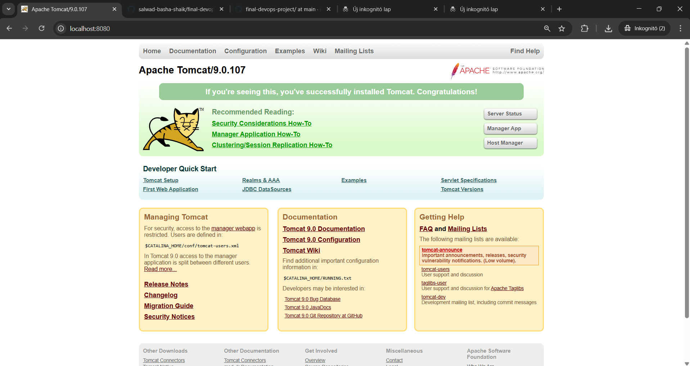
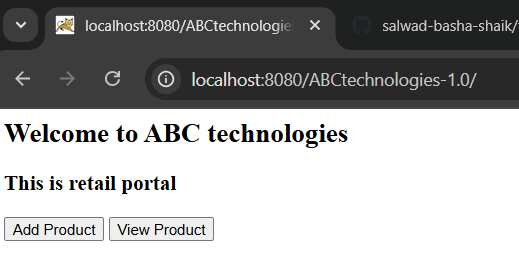

And in our kubernetes cluster:
```sh
./bin/kubectl
```
